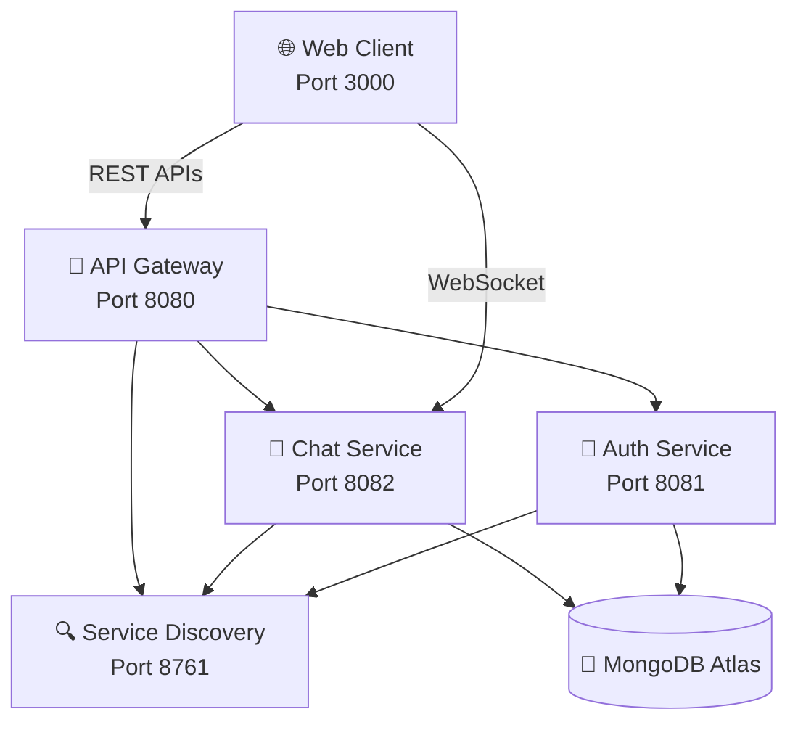

# 🚀 MaitriConnect - Realtime Chat Application

<div align="center">


*A modern, scalable microservices-based realtime chat application built with Spring Boot, Java, MongoDB, and WebSocket technology.*

</div>

---

## 📋 Table of Contents

- [🏗️ Architecture Overview](#️-architecture-overview)
- [✨ Features](#-features)
- [🛠️ Prerequisites](#️-prerequisites)
- [🚀 Quick Start](#-quick-start)
- [🌐 Service URLs](#-service-urls)
- [📡 API Documentation](#-api-documentation)
- [🔧 Configuration](#-configuration)
- [🧪 Testing](#-testing)
- [📁 Project Structure](#-project-structure)
- [🤝 Contributing](#-contributing)

---

## 🏗️ Architecture Overview

MaitriConnect follows a **microservices architecture** pattern with the following components:



### 🏢 Service Components

| Service | Port | Description | Technology Stack |
|---------|------|-------------|------------------|
| **🔍 Service Discovery** | 8761 | Eureka Server for service registration | Spring Cloud Netflix Eureka |
| **🚪 API Gateway** | 8080 | Routes requests & handles CORS | Spring Cloud Gateway |
| **🔐 Auth Service** | 8081 | User authentication & JWT management | Spring Security + JWT |
| **💬 Chat Service** | 8082 | Real-time messaging & WebSocket | Spring WebSocket + STOMP |

---

## ✨ Features

### 🔐 **Authentication & Security**
- ✅ User registration with validation
- ✅ Secure login with JWT tokens
- ✅ Password encryption with BCrypt
- ✅ Session management

### 💬 **Real-time Chat**
- ✅ Instant messaging with WebSocket
- ✅ Join/leave notifications
- ✅ Message persistence
- ✅ Chat room support

### 🏗️ **Microservices Architecture**
- ✅ Service discovery with Eureka
- ✅ API Gateway for routing
- ✅ Load balancing
- ✅ Independent service scaling

### 🌐 **Web Technologies**
- ✅ Responsive web client
- ✅ CORS support
- ✅ SockJS fallback for WebSocket
- ✅ Real-time UI updates

---

## 🛠️ Prerequisites

Before running MaitriConnect, ensure you have:

| Requirement | Version | Download Link |
|-------------|---------|---------------|
| ☕ **Java** | 17+ | [Download](https://adoptium.net/) |
| 📦 **Maven** | 3.6+ | [Download](https://maven.apache.org/download.cgi) |
| 🟢 **Node.js** | 14+ | [Download](https://nodejs.org/) |
| 🍃 **MongoDB Atlas** | Account | [Sign Up](https://www.mongodb.com/cloud/atlas) |

---

### 🔐 **JWT Configuration**

```properties
jwt.secret=your-512-bit-secret-key-here
jwt.expiration=86400000  # 24 hours
```

### 🌐 **CORS Configuration**

- **REST APIs**: Handled by API Gateway
- **WebSocket**: Direct connection to Chat Service
- **Origins**: Configured for `http://localhost:3000`

---

## 🧪 Testing

### 🎯 **Manual Testing**

1. **🔐 Test Authentication**
   - Open http://localhost:3000
   - Register a new user
   - Login with credentials

2. **💬 Test Real-time Chat**
   - Open multiple browser tabs
   - Login with different users
   - Send messages between users

3. **🔌 Test WebSocket Connection**
   - Open `test-websocket.html`
   - Click "Test WebSocket Connection"
   - Verify connection status

---

## 📁 Project Structure

```
MaitriConnect/
├── 🔍 service-discovery/          # Eureka Server
│   ├── src/main/java/
│   └── pom.xml
├── 🚪 api-gateway/                # Spring Cloud Gateway
│   ├── src/main/java/
│   └── pom.xml
├── 🔐 auth-service/               # Authentication Service
│   ├── src/main/java/
│   │   ├── controller/
│   │   ├── service/
│   │   ├── model/
│   │   └── dto/
│   └── pom.xml
├── 💬 chat-service/               # Chat & WebSocket Service
│   ├── src/main/java/
│   │   ├── controller/
│   │   ├── service/
│   │   ├── model/
│   │   └── config/
│   └── pom.xml
├── 🌐 chat-client.html            # Web Client
├── 🟢 serve-client.js             # Node.js Server
├── 🚀 start-services.bat          # Service Startup Script
├── 🌐 start-client.bat            # Client Startup Script
└── 📖 README.md                   # This file
```

---

## 🎨 **Technology Stack**

### **Backend**
- ☕ **Java 17** - Programming language
- 🍃 **Spring Boot 3.5.6** - Application framework
- 🔐 **Spring Security** - Authentication & authorization
- 🌐 **Spring WebSocket** - Real-time communication
- ☁️ **Spring Cloud** - Microservices framework
- 🍃 **MongoDB Atlas** - Cloud database
- 🔑 **JWT** - Token-based authentication

### **Frontend**
- 🌐 **HTML5/CSS3/JavaScript** - Web technologies
- 🔌 **SockJS** - WebSocket library
- 📡 **STOMP** - Messaging protocol
- 🟢 **Node.js** - Development server

### **DevOps & Tools**
- 📦 **Maven** - Build automation
- 🔍 **Eureka** - Service discovery
- 🚪 **Spring Cloud Gateway** - API gateway
- 🐳 **Microservices** - Architecture pattern

---

## 👨‍💻 Author

**Mahesh Shinde**
- 📧 Email: mahesh@example.com
- 🐙 GitHub: [@maheshshinde](https://github.com/maheshshinde9100)
- 💼 LinkedIn: [Mahesh Shinde](https://linkedin.com/in/maheshshinde9100)

---

<div align="center">

### 🌟 **Star this repository if you found it helpful!** 🌟

**Made by Mahesh using Spring Boot & Microservices**

</div>